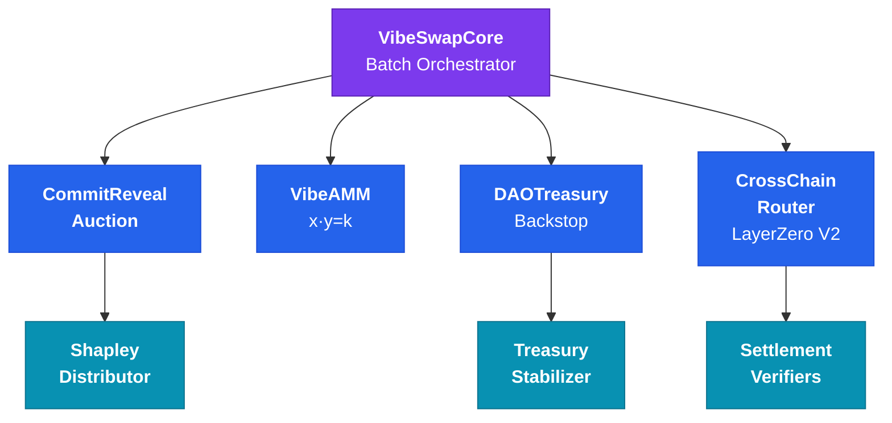

# VibeSwap

**Omnichain DEX that eliminates MEV through commit-reveal batch auctions with uniform clearing prices.**

[](https://soliditylang.org/)
[](https://book.getfoundry.sh/)
[](https://www.openzeppelin.com/contracts)
[](https://layerzero.network/)
[](LICENSE)

---

## Why VibeSwap Exists

Traditional DeFi is a Prisoner's Dilemma — your pending swap is visible in the mempool, bots extract value from every trade, and defection is rational. VibeSwap transforms this into an Assurance Game where cooperation is the optimal strategy.

**Core principles:**
- **Fairness Above All** — if the system is unfair, amend the code
- **No Extraction Ever** — Shapley math detects extraction; the system self-corrects autonomously
- **Cooperative Capitalism** — mutualized risk + free market competition. 100% of swap fees go to LPs. Zero to protocol.

Built from scratch by one engineer with no funding and no permission — now maintained by a growing team. The patterns developed for managing AI limitations during this build may become foundational for AI-augmented development.

> *"Tony Stark was able to build this in a cave. With a box of scraps."*

---

## How It Works — 10-Second Batch Auctions

```
  COMMIT (8s)              REVEAL (2s)              SETTLEMENT
  ─────────────            ─────────────            ──────────────────────
  Submit hash of order     Reveal actual order      1. Priority auction winners
  (nobody sees what        + optional priority      2. Fisher-Yates shuffle
   you're trading)         bid for early execution  3. All at uniform clearing price
```

1. **Commit:** Users submit `hash(order || secret)` with a deposit. Orders are invisible.
2. **Reveal:** Users reveal orders + optional priority bids. Batch seals.
3. **Settlement:** Priority winners execute first (bids go to LPs). Remaining orders are Fisher-Yates shuffled using XORed user secrets. Everyone gets the same clearing price.

Sandwich attacks require a "before" and "after" price. Batch auctions have ONE price. The attack vector doesn't exist.

---

## Architecture

**32 contract modules** spanning trading, cross-chain messaging, game-theoretic rewards, governance, and DeFi infrastructure:



| System | Key Contracts |
|--------|---------------|
| **Batch Auction** — commit-reveal + priority auction | `CommitRevealAuction`, `VibeSwapCore` |
| **AMM** — constant product (x·y=k) with batch execution | `VibeAMM`, `VibeLP` |
| **Fair Distribution** — Shapley value rewards | `ShapleyDistributor`, `IncentiveController` |
| **Cross-Chain** — unified liquidity via LayerZero V2 | `CrossChainRouter` |
| **Governance** — DAO treasury + counter-cyclical stabilization | `DAOTreasury`, `TreasuryStabilizer` |
| **Security** — circuit breakers, rate limiting, flash loan guards | `CircuitBreaker`, `RateLimiter` |
| **Settlement** — on-chain Shapley/trust/vote verification | `ShapleyVerifier`, `TrustScoreVerifier`, `VoteVerifier` |
| **Oracle** — TWAP + Python Kalman filter | `VolatilityOracle`, `TWAPOracle` |
| **Incentives** — IL protection, loyalty rewards, slippage guarantees | `ILProtectionVault`, `LoyaltyRewardsManager` |
| **Identity** — account abstraction + WebAuthn device wallets | `SmartAccount`, `SessionKeyManager` |

---

## Security

Defense-in-depth with independent protection layers:

| Layer | Implementation |
|-------|----------------|
| **Commit-reveal** hides orders until batch seals | `CommitRevealAuction.sol` |
| **Fisher-Yates shuffle** — no single participant controls the seed | `DeterministicShuffle.sol` |
| **Flash loan guard** — same-block interaction detection | `VibeSwapCore.sol` |
| **Circuit breakers** — volume, price, withdrawal anomaly detection | `CircuitBreaker.sol` |
| **TWAP validation** — max 5% deviation from time-weighted average | `VibeAMM.sol`, `TWAPOracle.sol` |
| **Rate limiting** — 100K tokens/hour/user, per-chain message limits | `RateLimiter.sol`, `CrossChainRouter.sol` |
| **50% slashing** for invalid reveals | `CommitRevealAuction.sol` |
| **`nonReentrant`** on every state-changing external function | All contracts |
| **UUPS + timelock** — no unilateral upgrades | `VibeTimelock.sol` |

---

## Game Theory

VibeSwap uses [Shapley values](https://en.wikipedia.org/wiki/Shapley_value) from cooperative game theory — the only allocation mechanism that is simultaneously efficient, symmetric, and null-player-safe:

- **Shapley distribution** rewards marginal contribution, not just liquidity size
- **Priority auctions** let arbitrageurs pay for execution priority — bids go to LPs, not validators
- **Insurance pools** mutualize risk (IL protection, slippage guarantees, treasury stabilization)

The mechanism makes virtue the optimal strategy.

> *"Rewards cannot exceed revenue. Compounding is limited to realized events. Cooperation is rational, not moral."*

---

## At a Glance

| Metric | Value |
|--------|-------|
| Solidity contracts | **364** across 32 modules |
| Test files | **394** (unit, fuzz, invariant, integration, security) |
| Proxy architecture | UUPS upgradeable (OpenZeppelin v5.0.1) |
| Cross-chain | LayerZero V2 OApp — Ethereum, Arbitrum, Optimism, Base |
| Research | **242** original mechanism design papers |
| Frontend | React 18 + Vite 5 + ethers.js v6 — 338 components, 72 hooks — [live demo](https://frontend-jade-five-87.vercel.app) |

---

## Quick Start

```bash
# Install Foundry (if needed): https://book.getfoundry.sh/getting-started/installation

git clone https://github.com/wglynn/vibeswap.git
cd vibeswap

forge install
forge build                        # First build uses via-ir, may take a few minutes
FOUNDRY_PROFILE=fast forge build   # Faster iteration during development
forge test -vvv

# Frontend
cd frontend && npm install && npm run dev
```

### Deployment

```bash
# Local (Anvil)
anvil
forge script script/Deploy.s.sol --rpc-url http://localhost:8545 --broadcast

# Testnet (Sepolia)
cp .env.example .env  # Configure RPC URLs and keys
forge script script/Deploy.s.sol --rpc-url $SEPOLIA_RPC_URL --broadcast --verify

# Configure cross-chain peers
forge script script/ConfigurePeers.s.sol --rpc-url $SEPOLIA_RPC_URL --broadcast
```

---

## Tech Stack

```
Contracts:    Solidity 0.8.20  ·  Foundry  ·  OpenZeppelin v5.0.1  ·  LayerZero V2
Frontend:     React 18  ·  Vite 5  ·  Tailwind CSS  ·  ethers.js v6  ·  WebAuthn
Oracle:       Python 3.9+  ·  Kalman filter  ·  Bayesian estimation
Testing:      Foundry (unit + fuzz + invariant)  ·  Slither  ·  394 test files
Deployment:   Anvil (local)  ·  Sepolia/Mainnet  ·  Vercel (frontend)
```

---

## Project Structure

```
vibeswap/
├── contracts/                 # 364 Solidity files across 32 modules
│   ├── core/                  #   CommitRevealAuction, VibeSwapCore
│   ├── amm/                   #   VibeAMM (x·y=k), VibeLP
│   ├── governance/            #   DAOTreasury, TreasuryStabilizer, VibeTimelock
│   ├── incentives/            #   ShapleyDistributor, ILProtection, LoyaltyRewards
│   ├── messaging/             #   CrossChainRouter (LayerZero V2)
│   ├── settlement/            #   ShapleyVerifier, TrustScoreVerifier, VoteVerifier
│   ├── identity/              #   SmartAccount, SessionKeyManager
│   ├── oracle/                #   VolatilityOracle
│   ├── security/              #   CircuitBreaker, RateLimiter
│   └── libraries/             #   DeterministicShuffle, BatchMath, TWAPOracle
├── test/                      # 394 test files
├── script/                    # Deployment scripts
├── frontend/                  # React 18 + Vite 5 (338 components, 72 hooks)
├── oracle/                    # Python Kalman filter price oracle
├── DOCUMENTATION/             # 242 original research papers
└── docs/                      # Proposals and additional docs
```

---

## Research

| Paper | Topic |
|-------|-------|
| [Whitepaper](DOCUMENTATION/VIBESWAP_WHITEPAPER.md) | Complete protocol specification |
| [Mechanism Design](DOCUMENTATION/VIBESWAP_COMPLETE_MECHANISM_DESIGN.md) | Batch auctions, Fibonacci scaling, Shapley distribution |
| [Incentives](DOCUMENTATION/INCENTIVES_WHITEPAPER.md) | Game theory, IL protection, loyalty rewards |
| [True Price Oracle](DOCUMENTATION/TRUE_PRICE_ORACLE.md) | Kalman filter, Bayesian estimation, regime detection |
| [Security](DOCUMENTATION/SECURITY_MECHANISM_DESIGN.md) | Anti-fragile security, cryptoeconomic defense |
| [Formal Fairness Proofs](DOCUMENTATION/FORMAL_FAIRNESS_PROOFS.md) | Mathematical proofs of fairness properties |

See [`DOCUMENTATION/`](DOCUMENTATION/) for all 242 papers.

---

## License

MIT
