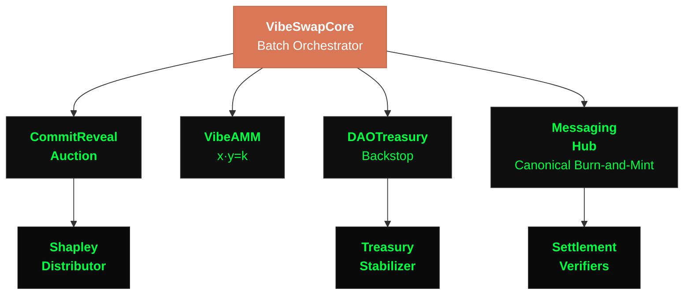

# VibeSwap

> *a coordination primitive, not a casino.*

**An MEV-resistant DEX mechanism built on commit-reveal batch auctions with uniform clearing prices.** Currently mid-migration from Solidity contracts to a sovereign Nervos-CKB-fork chain where the same mechanisms run as native cell-type-scripts instead of EVM bytecode.

[](https://soliditylang.org/)
[](https://book.getfoundry.sh/)
[](https://www.openzeppelin.com/contracts)
[](contracts-ckb/CHAIN_BUILD_README.md)
[](docs/README.md)

## Status (2026-06-09)

> **VibeSwap is not publicly deployed.** No public mainnet. No public testnet. A local CKB dev chain is up and mining blocks (`contracts-ckb/FIRST_BLOCK_RECEIPT.md`, chain spec `vibeswap_ckb_dev`), but the cells are still spec-only on it — runtime alive, contracts not yet on-chain. `deployments/` is empty by design — the protocol is mid-pivot to a sovereign chain and we don't want a vestigial Solidity deployment competing with the canonical version.
>
> - **EVM contracts** (`contracts/`, Solidity 0.8.20): mechanism spec + reference implementation. Used for audits, fuzz testing, and as the source-of-truth for the CKB port. 579 Foundry tests passing.
> - **CKB chain** (`contracts-ckb/`, Rust RISC-V cells): the real target. 26 cells building, dev chain mining blocks (`contracts-ckb/FIRST_BLOCK_RECEIPT.md`). Sovereign deployment, not a side-chain. See [`contracts-ckb/FORK_PLAN.md`](contracts-ckb/FORK_PLAN.md).
> - **Frontend** ([live demo](https://frontend-jade-five-87.vercel.app)): runs against a mock backend. Wallet flows work; swap settles against simulated batches.
>
> If you came here looking to swap: come back later. If you came here to audit, fork, or read the mechanism design: keep reading.

## What this repo is for, by audience

| You are | Read this first | Skip |
|---|---|---|
| **An auditor or security researcher** | `contracts/core/` + `docs/audits/` (multiple dated reports through 2026-05-12) + the threat-model section below | The 34-module sprawl outside core unless explicitly scoped |
| **A developer wanting to crib MEV-resistance ideas** | [`contracts/core/CommitRevealAuction.sol`](contracts/core/CommitRevealAuction.sol) + [the batch-auction paper](docs/research/papers/) + `contracts/libraries/DeterministicShuffle.sol` | Everything else; the rest is downstream of these three artifacts |
| **A CKB / Nervos engineer** | [`contracts-ckb/CHAIN_BUILD_README.md`](contracts-ckb/CHAIN_BUILD_README.md) + [`FORK_PLAN.md`](contracts-ckb/FORK_PLAN.md) + the cell-type-script directories | Solidity `contracts/` unless you want the reference behavior to port-against |
| **A protocol researcher** | [`docs/research/papers/`](docs/research/) (123 papers) + [`docs/INDEX.md`](docs/INDEX.md) encyclopedia | The deployment runbooks and frontend |
| **A potential trader** | Nothing. Come back when there's a testnet. | This README, for now |

## Core mechanism — 10-second batch auctions

```
  COMMIT (8s)              REVEAL (2s)              SETTLEMENT
  ─────────────            ─────────────            ──────────────────────
  Submit hash of order     Reveal actual order      1. Priority auction winners
  (nobody sees what        + optional priority      2. Fisher-Yates shuffle
   you're trading)         bid for early execution  3. All at uniform clearing price
```

1. **Commit:** Users submit `hash(order || secret)` with a deposit. Orders are invisible.
2. **Reveal:** Users reveal orders + optional priority bids. Batch seals.
3. **Settlement:** Priority winners execute first (bids go to LPs). Remaining orders are Fisher-Yates shuffled using XORed user secrets. Everyone gets the same clearing price.

Sandwich attacks require a "before" and "after" price. Batch auctions have one price. The attack vector doesn't exist within a batch.

The full mechanism spec lives in [`docs/research/papers/`](docs/research/) — see the whitepaper and the batch-auction mechanism paper.

## Architecture



### Core mechanism contracts (audit scope)

| System | Key Contracts |
|--------|---------------|
| **Batch Auction** — commit-reveal + priority auction | `CommitRevealAuction`, `VibeSwapCore` |
| **AMM** — constant product (x·y=k) with batch execution | `VibeAMM`, `VibeLP` |
| **Fair Distribution** — Shapley value rewards | `ShapleyDistributor` |
| **Cross-Chain** — canonical burn-and-mint with bonded validators ([spec](docs/research/papers/post-layerzero-canonical-messaging.md)) | `IMessagingHub` (interface — chain-native impl on the CKB-fork), `VibeSwapCanonicalToken`, `MessagingValidatorRegistry`, `SupplyAccountant`, `MessagingPoM` |
| **Governance** — DAO treasury + counter-cyclical stabilization | `DAOTreasury`, `TreasuryStabilizer`, `VibeTimelock` |
| **Security** — circuit breakers, rate limiting, flash-loan guards | `CircuitBreaker`, `RateLimiter` |
| **Oracle** — TWAP + off-chain Kalman filter | `TWAPOracle`, `VolatilityOracle` |

### Extension surface (out of scope for the core audit)

The `contracts/` tree has 34 module directories. Beyond the core above, the rest are **research surface** — speculative mechanism work, not part of the launch scope, not on the audit critical path:

`account/`, `agents/`, `bridge/`, `community/`, `compliance/`, `compute/`, `consensus/`, `depin/`, `financial/`, `framework/`, `hooks/`, `ideas/`, `identity/`, `intent-markets/`, `mechanism/`, `metatx/`, `monetary/`, `naming/`, `oracles/`, `psinet/`, `quantum/`, `reputation/`, `rwa/`, `settlement/`.

These exist for one of three reasons: (1) a mechanism the author is exploring as future work, (2) a port-source for the CKB chain's extended primitive set, or (3) abandoned exploration kept for git-history. If you're auditing the protocol that ships, ignore them. If you're researching, browse freely.

## Threat model and defense in depth

| Layer | Implementation |
|-------|----------------|
| **Commit-reveal** hides orders until batch seals | `CommitRevealAuction.sol` |
| **Fisher-Yates shuffle** — XORed user secrets, no single party controls the seed | `DeterministicShuffle.sol` |
| **Flash-loan guard** — same-block interaction detection | `VibeSwapCore.sol` |
| **Circuit breakers** — volume, price, withdrawal anomaly detection | `CircuitBreaker.sol` |
| **TWAP validation** — max 5% deviation from time-weighted average | `VibeAMM.sol`, `TWAPOracle.sol` |
| **Fibonacci-scaled throughput** — per-user per-pool, progressive damping along φ-ratios | `FibonacciScaling.sol` |
| **50% slashing** for invalid reveals | `CommitRevealAuction.sol` |
| **`nonReentrant`** on every state-changing external function | All contracts |
| **UUPS + timelock** — no unilateral upgrades | `VibeTimelock.sol` |

Audits to date are dated and in `docs/audits/` — `2026-04-27-maintenance-synthesis`, `2026-05-01-storage-layout-followup`, `2026-05-06-empty-catch-sweep`, `2026-05-12_aa2-audit-claim-vs-enforcer`. These are reader-runnable: every finding cross-references the contract + line and a closing commit.

## Game theory

VibeSwap uses [Shapley values](https://en.wikipedia.org/wiki/Shapley_value) from cooperative game theory — the only allocation mechanism that is simultaneously efficient, symmetric, and null-player-safe:

- **Shapley distribution** rewards marginal contribution, not just liquidity size.
- **Priority auctions** let arbitrageurs pay for execution priority — bids go to LPs, not validators.
- **Insurance pools** mutualize risk (IL protection, slippage guarantees, treasury stabilization).

The mechanism makes virtue the optimal strategy.

> *"Rewards cannot exceed revenue. Compounding is limited to realized events. Cooperation is rational, not moral."*

## Counts (honest, against current state)

| Metric | Value |
|--------|-------|
| Solidity files in `contracts/` | **431** across 34 module directories |
| Foundry test files in `test/` | **579** |
| CKB cell-type-scripts (Rust RISC-V) | **26** building, dev chain mining |
| Proxy architecture (EVM) | UUPS upgradeable (OpenZeppelin v5.0.1) |
| Cross-chain | Canonical burn-and-mint — bonded validators, BLS threshold attestations, on-chain economic security ([spec](docs/research/papers/post-layerzero-canonical-messaging.md)) |
| Research papers | **123** in `docs/research/papers/` |
| Audits | 4 dated reports in `docs/audits/` through 2026-05-12 |
| Deployments | **none** (by design, mid-pivot — see Status above) |
| Frontend | React 18 + Vite 5 + ethers.js v6 — runs against mock backend; [demo](https://frontend-jade-five-87.vercel.app) |

## Quick Start (run locally)

```bash
# Install Foundry: https://book.getfoundry.sh/getting-started/installation

git clone https://github.com/wglynn/vibeswap.git
cd vibeswap

forge install
forge build                                            # default profile = fast, no via_ir
forge test --match-path test/CommitRevealAuction.t.sol -vvv    # ALWAYS scope test runs — 579 files is too much for one suite

# Frontend (mock backend)
cd frontend && npm install && npm run dev              # localhost:3000
```

> **Foundry profile discipline**: the default profile is `via_ir: false` and tests should always use `--match-path` or `--match-contract`. The full suite under via-IR will OOM on a 16GB machine. Use `FOUNDRY_PROFILE=full` only for deploy validation. See [`docs/developer/`](docs/developer/README.md).

### Deployment (not mainnet — see Status)

```bash
# Local Anvil only — there is no production deploy
anvil
forge script script/Deploy.s.sol --rpc-url http://localhost:8545 --broadcast
```

### Building the CKB chain

```bash
cd contracts-ckb
# See CHAIN_BUILD_README.md for the full build matrix
cargo build --release
# Dev chain bring-up:
./scripts/run-dev-chain.sh    # spec at contracts-ckb/vibeswap_ckb_dev
```

## Tech Stack

```
EVM contracts:  Solidity 0.8.20  ·  Foundry  ·  OpenZeppelin v5.0.1
CKB cells:      Rust  ·  ckb-std 0.16  ·  RISC-V target  ·  sha2 0.9  ·  bls12_381 0.8
Messaging:      VibeSwap canonical burn-and-mint  ·  BLS12-381 threshold sigs  ·  bonded validator network
Frontend:       React 18  ·  Vite 5  ·  Tailwind CSS  ·  ethers.js v6  ·  WebAuthn
Oracle:         Python 3.9+  ·  Kalman filter  ·  Bayesian estimation
Testing:        Foundry (unit + fuzz + invariant)  ·  Slither  ·  579 .t.sol files
```

## Project Structure

```
vibeswap/
├── contracts/                 # 431 Solidity files across 34 module dirs
│   ├── core/                  #   CommitRevealAuction, VibeSwapCore, CircuitBreaker, ProofOfMind, ...
│   ├── amm/                   #   VibeAMM (x·y=k), VibeLP
│   ├── governance/            #   DAOTreasury, TreasuryStabilizer, VibeTimelock
│   ├── incentives/            #   ShapleyDistributor, ILProtection, LoyaltyRewards
│   ├── messaging/             #   IMessagingHub (impl on CKB-fork), VibeSwapCanonicalToken, ...
│   ├── settlement/            #   ShapleyVerifier, TrustScoreVerifier, VoteVerifier
│   ├── identity/              #   SmartAccount, SessionKeyManager
│   ├── security/              #   CircuitBreaker, RateLimiter
│   ├── libraries/             #   DeterministicShuffle, BatchMath, TWAPOracle, FibonacciScaling
│   └── (24 more module dirs)  #   extension surface — research, not core audit scope
├── contracts-ckb/             # Sovereign CKB-fork chain (26 cells building, dev chain mining)
├── test/                      # 579 Foundry test files
├── script/                    # Foundry deployment scripts (local-anvil only — no mainnet)
├── frontend/                  # React 18 + Vite 5 (mock backend)
├── oracle/                    # Python Kalman filter price oracle
├── docs/                      # All documentation, audits, research, partnerships
│   ├── INDEX.md               #   encyclopedia of every primitive
│   ├── architecture/          #   system design — consensus, AMM, oracle, cross-chain
│   ├── research/              #   papers, theorems, formal proofs (123 papers)
│   ├── audits/                #   dated audit reports
│   ├── developer/             #   build, test, deploy, integrate
│   ├── governance/            #   VIPs, VSPs, proposals
│   └── partnerships/          #   collaboration docs
└── deployments/               # Empty by design — see Status section
```

## Contributing & Security

- **Contributing**: see [`CONTRIBUTING.md`](CONTRIBUTING.md) for fork/branch/PR workflow, Solidity conventions, Foundry test discipline, and commit format.
- **Security**: see [`SECURITY.md`](SECURITY.md) for responsible disclosure. **Reach out privately before any public report.** Past disclosures are summarized in [`docs/audits/`](docs/audits/README.md).

## About

VibeSwap was built from scratch by one engineer, who is now joined by additional collaborators. The protocol is pre-revenue, pre-mainnet, and self-funded. The core mechanism is the load-bearing artifact; everything else in the repo (essays, marketing docs, exploration directories) is downstream of it. The author writes about the protocol in [the research papers](docs/research/), [the Medium archive](https://medium.com/blockchain-philosophy), and on [the Telegram channel](https://t.me/+3uHbNxyZH-tiOGY8).

Core principles (load-bearing — these constrain code review):

- **Fairness Above All** — if the system is unfair, amend the code.
- **No Extraction Ever** — Shapley math detects extraction; the system self-corrects autonomously.
- **Cooperative Capitalism** — mutualized risk + free market competition. 100% of swap fees go to LPs. Zero to protocol.

## License

License terms are still being finalized. Libraries and tooling within this repository are intended as MIT; core protocol contracts are reserved pending a formal license decision. Until a top-level `LICENSE` file lands, treat this repository as **all rights reserved** by default — see individual files for SPDX headers where applicable.
